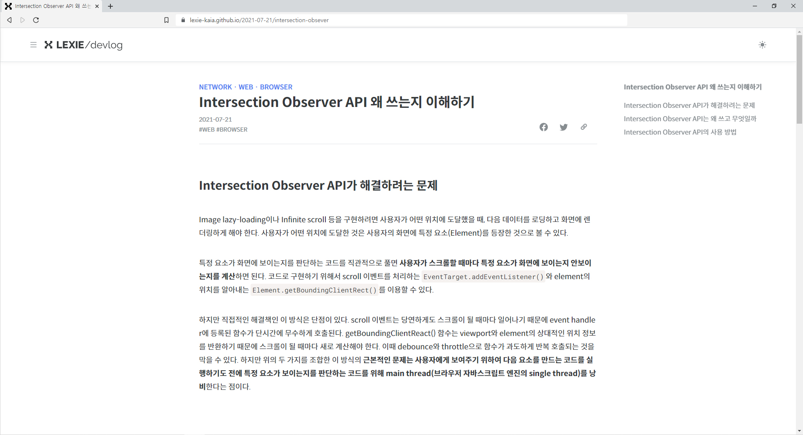
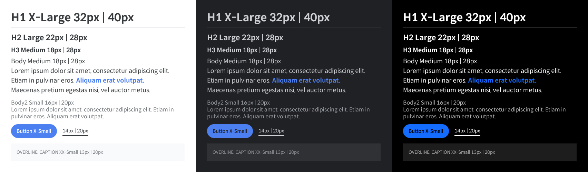

# Lexia-Kaia Devlog

<br/>

프론트엔드 기술을 중심으로 공부한 내용을 기록할 목적으로 만든 기술 블로그입니다.  
Static Site Generator인 Gatsby를 기반으로 개발하였습니다.

[>View Live](https://lexie-kaia.github.io/)

<br/>

### Tech Stacks

React | TypeScript | Emotion(CSS-in-JS) | MDX | GraphQL

<br/>

### Features

```
must have
- create home, 404 page
- generate individual post page using mdx contents

good to have
- /home
  - add post filtering by tag & category
  - add infinite scroll on post list
  - add default/compact view switch
- /post
  - add Utterance
  - add related contents links
  - add prev, next post links
  - add table of contents
  - add share buttons

nice to have
- implement responsive side menu
- implement color mode
- improve SEO
- add Google Analytics
```

<br/>
<br/>
<br/>





<br/>
<br/>

## Objectives

<br/>

그동안 배운 지식을 활용하여 **실제 사용할 수 있는 웹 사이트를 완성**하고 싶었습니다. 프로젝트 기획, UI/UX 개발 및 기능 구현, SEO, 완성 후 GA를 이용한 트래픽 분석까지 통합된 경험을 하는 것을 목표로 하였습니다.

<br/>
<br/>

## Tech Stacks

<br/>

1. React + TypeScript + Emotion(CSS-in-JS)
2. Building : Gatsby vs Next.js → Gatsby
3. Contents Management : Markdown(Mdx) vs CMS(Contentful) → Markdown(Mdx)

<br/>

### React + TypeScript + Emotion(CSS-in-JS)

사이트를 만드는 과정에서 시행착오를 거듭할 것이 분명하였기에 **폴더 구조와 모듈의 관계를 최대한 단순하게 구성**하기로 하였습니다. 따라서 React, TypeScript, Ecomtion(CSS-in-JS) 선택하여 JavaScript를 중심으로 통합 관리하는 구조로 만들었습니다.

<br/>

### Building : Gatsby

1. **Blog → SSG(Static Site Generation)**

   '콘텐츠의 업데이트가 잦은가? 콘텐츠의 양이 많은가?' 이 질문에 답이 '그렇다'라면 SSR과 빌드 시간을 생각하여 Next.js도 고려하였겠지만, 블로그 완성 이후 예상되는 콘텐츠의 양과 업데이트가 SSG의 단점을 부각하지 않는 정도라고 판단하였습니다. 그래서 **SSG를 쉽고 빠르게 만들 수 있는 Gatsby**를 선택하였고, 더불어 Gatsby에서 제공하는 **이미지 최적화 기능**을 활용하여 성능이 좋은 사이트를 만들 수 있을 것으로 생각하였습니다.

2. **GraphQL**

   Gatsby 선택한 이유 중 하나는 Gatsby가 **GraphQL을 입문하기 좋은 환경**이라 생각했기 때문입니다. Gatsby에서 자체적인 GraphQL API(data graph layer)를 제공하기 때문에 별도의 Interface 구현 없이 바로 GraphQL을 이용하여 데이터를 조회할 수 있습니다.

   GraphQL을 사용하려 한 이유는 GraphQL을 이용하면 **요청한 것과 동일한 형태의 데이터를 받아서 사용**할 수 있고, **다양한 타입과 소스의 데이터를 하나의 요청으로 처리**할 수 있기 때문입니다. 즉 GraphQL의 declarative data fectching 방식이 개발 과정을 더 간단하게 만들 것으로 생각했습니다.

<br/>

### Content Management : Markdown(Mdx)

Gatsby를 이용하면 Contentful 등의 콘텐츠 작성과 관리를 도와주는 Headless CMS과 쉽게 연동할 수 있습니다. 하지만 한편으로 **CMS와 Gatsby에 대한 의존성이 우려**되었습니다. 콘텐츠의 수명이나 새로운 기술 스택 도입 등의 이유로 블로그를 다시 개발하는 상황을 고려하여 기본적인 Markdown 문서로 콘텐츠를 작성하기로 하였습니다.

<br/>
<br/>

## Key takeaways

<br/>

### SSG(Static Site Generator)라는 말이 주는 오해 : SSR at build time

<br/>

Gatsby에서 color mode(dark-light mode) 구현 과정에서 몇 번의 시행착오가 있었습니다. 이를 해결하는 과정에서 Gatsby 빌드 프로세스에 관해서 공부하였고 SSG에 대해 오해하고 있음을 알게 되었습니다.

<br/>

SSG(Static Site Generator)는 페이지별로 배포할 **HTML, CSS, JS 파일을 빌드 시 미리 생성**합니다. 다만 일반적인 정적 사이트(Static Site)와 다르게 Gatsby를 통해서 만들어지는 정적 사이트는 React를 포함합니다. 그래서 사용자가 웹 사이트를 이용할 때 React가 rehydrate되면서 다시 SPA의 기능이 활성화됩니다.

Static Site와 SPA가 공존하는 SSG에 대해서 Gatsby의 공식블로그는 'Gatsby produces optimized static content by invoking server-side APIs(react) at build time'이라고 설명합니다. 'SSR at build time' 이 말이 내포하는 바는 **SSR에서 발생할 수 있는 이슈를 Gatsby의 SSG에서도 똑같이 대응**해야 한다는 점입니다. color mode 개발 과정에서의 예를 들면 hydration 이전 이후에 발생할 수 있는 flicker 현상을 고려해야 했고, window 객체나 web API를 사용할 때 주의해야 했습니다.

SSR과 SSG는 공통적으로 React의 Server-side API가 사용하지만, SSR과 SSG를 구분하는 차이점은 static content 즉 HTML이 생성되는 시점입니다. SSG는 빌드 과정에서 미리 HTML을 생성하기 때문에 별도의 서버를 없이 **CDN(Content Delivery Network)을 활용하여 배포**할 수 있습니다.

<br/>
<br/>

## Tasks

### **phase 1. project setup**

- [x] install gatsby cli  
       `$npm i gatsby-cli`
- [x] create a new site  
       `$gatsby new devlog https://github.com/gatsbyjs/gatsby-starter-hello-world`
- [x] run development build  
       `$gatsby develop`
- [x] add dependencies
  - TypeScript
    - [x] install TS compiler  
           `$npm i -D typescript`
    - [x] config `tsconfig.json`  
           `$npx tsc --init`
    - [x] run TS compiler for type checking  
           `$npx tsc -w`
  - styling
    - [x] install Emotion  
           `$npm i gatsby-plugin-emotion @emotion/react @emotion/styled`
    - [x] add fonts
      - [x] install react helmet for webfonts  
             `$npm i gatsby-plugin-react-helmet react-helmet @types/react-helmet`
      - webfonts
        - Spoqa han sans
        - Roboto mono
    - [x] add global styles and theme
      - [x] ~~add `@types/emotion.d.ts` for theming~~  
             color theme : Emotion theme → CSS var
    - [x] add Bootstrap icon  
           `$npm i react-bootstrap-icons`  
           [https://icons.getbootstrap.com/](https://icons.getbootstrap.com/)
    ```
    /
    |- ~~@types~~
    |   `- ~~emotion/~~
    |       `- ~~index.d.ts // src/styles/emotion.d.ts~~
    `- src
       |- components
       |   `- Layout.tsx
       |- styles
    			 |- GlobalStyles.tsx
    ```

### phase2. planning rounting and component structure

|          | route                                 | e.g                               | path                                                                       |
| -------- | ------------------------------------- | --------------------------------- | -------------------------------------------------------------------------- |
| **home** | /<br/>/?category={category}&tag={tag} | /<br/>/?category=gatsby&tag=react | /src/pages/index.tsx                                                       |
| **post** | /{post-date}/{post-slug}              | /2020-20-20/hello-world           | /contents/2020-20-20/hello-world.mdx<br/>/src/templates/post_templates.tsx |
| **404**  |                                       |                                   | /src/pages/404.tsx                                                         |

```
/
|- contents
|   `- 2020-20-20
`- src
    |- components
    |   |- common
    |   |- layout
    |   |- global
    |   `- pages
    |       |- home
    |       |- post
    |       `- notfound
    |- pages
    |   |- index.tsx
    |   |- 404.tsx
    `- templates
        `- PostTemplate.tsx
```

### phase 3. adding gatsby plugin

- [x] file system  
       `$npm i gatsby-source-filesystem`
- [x] image optimization  
       prerequisites : `gatsby-source-filesystem`  
       `$npm i gatsby-plugin-image gatsby-plugin-sharp gatsby-transformer-sharp`
- [x] markdown(mdx)  
       `$npm i gatsby-plugin-mdx @mdx-js/mdx @mdx-js/react`  
       prerequisites : `gatsby-plugin-sharp`  
       `$npm i gatsby-remark-images`  
       `$npm i gatsby-remark-prismjs prismjs`  
       `$npm i gatsby gatsby-remark-autolink-headers`

### phase 4. create home/post page and must-have features

- [x] create master layout draft
  - [x] layout
    - [x] header
      - [x] logo image
            svg -> react component converter: [https://transform.tools/](https://transform.tools/)
    - [x] footer
    - [x] sidemenu
- [x] implement home page main
  - [x] add post list
- [x] create 404 page
- [x] create post dummy contents
  - [x] mdx frontmatter
  ```
  title: string;
  date: string; // 2020-20-20
  category: string; // lowercase, no whitespace
  tags: string[]; // lowercase
  thumbnail?: string; // path
  ```
- [x] create post page and link to contents
  - [x] create `PostTemplate.tsx`
  - [x] generate individual post page w/ `gatsby-node.js`
- [x] style post body
  - [x] style mdx body
  - [x] add prismjs theme(css) on `gatsby-browser.js`
- [x] get post, tag, category link list on home page

### phase 5. implement additional feactures

- [x] home page
  - [x] add post filtering w/ tag & category
  - [x] add infinite scroll on post list
  - [x] add default/compact view switch
- [x] post page
  - [x] add Utterance
  - [x] add related contents links
  - [x] add prev, next post links
  - [x] add table of contents
  - [x] add share buttons
- [x] global
  - [x] implement responsive side menu
  - [x] implement color mode

### phase 6. SEO

- [x] add HTML head tags
  - [x] title & meta
  - [x] og & twitter
  - [x] canonical link
  - [x] webmasters(google and naver)
- [x] add sitemap.xml and robots.txt  
       `$npm i gatsby-plugin-sitemap`  
       `$npm i gatsby-plugin-robots-txt`

### phase 8. deploying → github pages

- [x] add deploying script
- [x] submit the url and sitemap to webmasters(google & naver)
- [x] add GA  
       `$npm i gatsby-plugin-google-gtag`

<br/>
